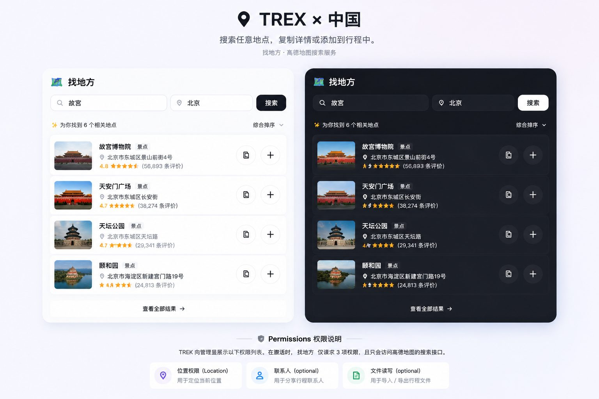
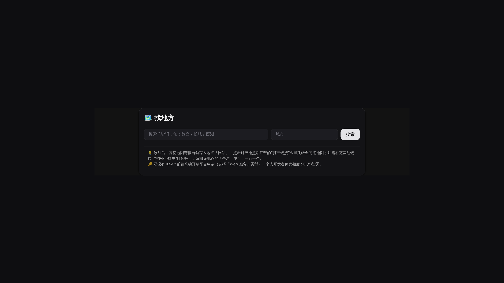
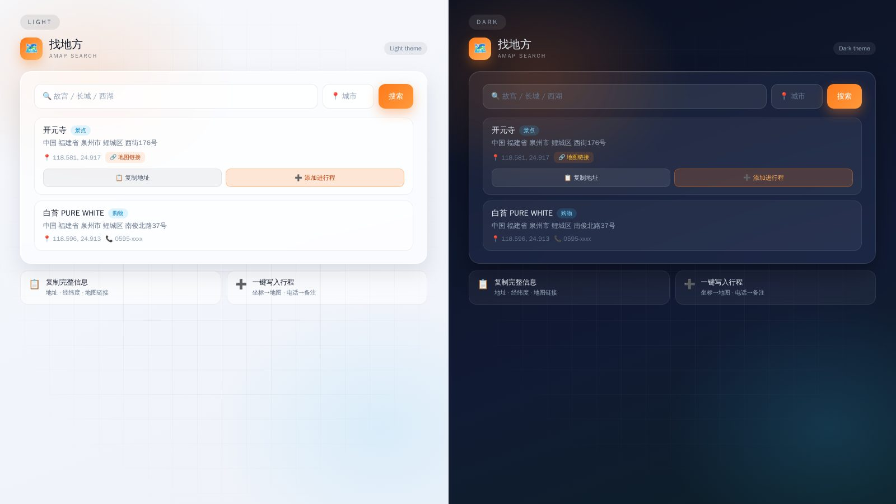

# 🗺️ 找地方 (amap-search)

简体中文 | [English](README.en.md)

在 TREK 行程里直接搜索高德 POI（地点），一键复制地址或添加进当前行程（自动带坐标、地图链接、电话）。

## 功能

**找地方** 以 **trip-page** 类型挂在行程规划器内部（TREK 3.4+），始终跟随当前打开的行程。搜索高德上的任意地点，然后复制详情或直接写进行程。

- 🗺️ **高德 POI 关键字搜索**（可指定城市，不填则全国搜索）
- 📋 **复制地址**：一键复制 名称 / 完整地址（中国·省·市·区·街道）/ 经纬度 / 地图链接 / 类型 / 电话
- ➕ **添加进行程**：写入当前行程，自动带上：
  - **坐标**（经纬度）
  - **地址**
  - **类型 → 描述**
  - **高德地图链接 → 「网站」字段**（点击地点卡片的"打开链接"跳转高德）
  - **电话 → 「备注」字段**（另起一行）
- 🔑 **每个用户自己填高德 Key**（设置 → 插件，加密存储，不进代码）
- 💡 **Key 引导语智能显隐**：没填 Key 时显示申请引导，填好或搜索成功后自动隐藏

## 来中国旅游？这个插件能帮到你

TREK 自带的搜索用的是 OpenStreetMap，找地标没问题，但找那些让旅程变特别的小店（隐藏咖啡馆、小吃摊、精品店）就抓瞎了。高德是中国最详细的地图，本插件让你在 TREK 里直接用上它：

- 按关键词搜索中国 POI（试试 故宫 / 长城 / 西湖，或任何本地小店名）
- 一键复制完整地址——街道、区、市、国家——外加经纬度和高德地图链接
- 一键把地点添加进当前行程，坐标、地址、地图链接自动填好

唯一要求是一个高德 Web 服务 API Key（[console.amap.com](https://console.amap.com/)）。个人开发者配额每天 50 万次调用——注册可能需要中国手机号，但拿到 Key 之后，搜中国地点比只用 OSM 容易太多了。

## 截图

插件界面自动跟随 TREK 的亮/暗主题。

## 权限

激活时 TREK 会向管理员展示此列表。本插件只申请三个权限，且仅与高德搜索接口通信。

| 权限 | 用途 |
|---|---|
| `db:read:trips` | 读取当前行程上下文 |
| `db:write:places` | 在行程中创建地点 |
| `http:outbound:restapi.amap.com` | 调用高德 POI 搜索接口（服务端，唯一网络请求） |

## 安装配置

### 1. 安装

1. 打包：`npx trek-plugin-sdk pack` → `plugin.zip`
2. TREK → Admin → Plugins → **Upload** → 选择 zip
3. 激活并同意权限

### 2. 申请高德 Key

- 高德开放平台：<https://console.amap.com/>
- 注册（支付宝/手机号即可）→ 控制台 → 应用管理 → 创建新应用 → 添加 Key
- 类型选 **Web 服务**（不是 Web 端 JS API！）
- 个人开发者配额 50 万次/天，搜地点根本用不完

### 3. 使用

1. 打开任意行程 → 顶部 tab 栏出现「找地方」
2. 输入关键词（如：故宫 / 长城 / 西湖）+ 城市（可选）→ 搜索
3. **📋 复制地址** → 复制完整地址 / 经纬度 / 地图链接
4. **➕ 添加进行程** → 写入当前行程（坐标 / 地址 / 类型 / 网站链接 / 电话备注一步到位）

### 链接说明

- **高德地图链接**自动存入地点的「网站」字段，点击地点卡片底部的"打开链接"即可跳转至高德地图。
- **其他链接**（官网/小红书/抖音等）：编辑该地点的「备注」添加，一行一个（备注里链接可点击）。例：`小红书: http://xhslink.cn/xxx`

## 兼容性

- 需要 **TREK >=3.4.0**（`>=3.4.0 <4.0.0`）
- 无原生模块，无付费 API（高德 API 个人开发者配额 50 万次/天）

## 支持

- Issues & questions: <https://github.com/imusic-487/Trek-Amap-search/issues>
- Source & changelog: <https://github.com/imusic-487/Trek-Amap-search>

## 许可

MIT — 见 [LICENSE](./LICENSE)。

社区插件，非 TREK 核心团队维护。
